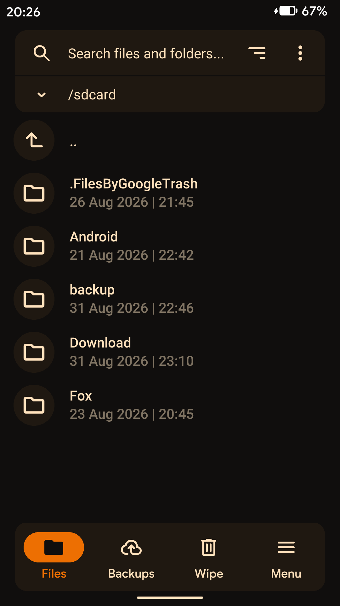
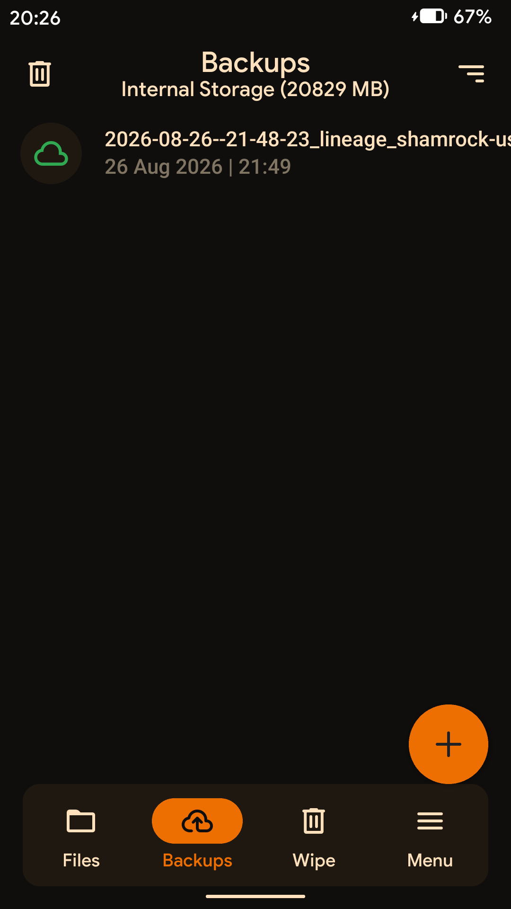
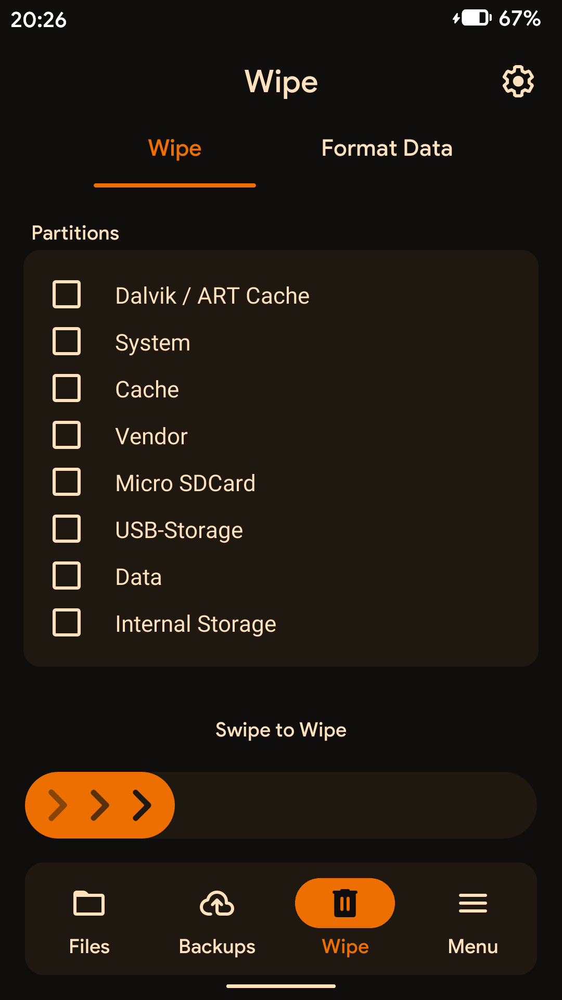
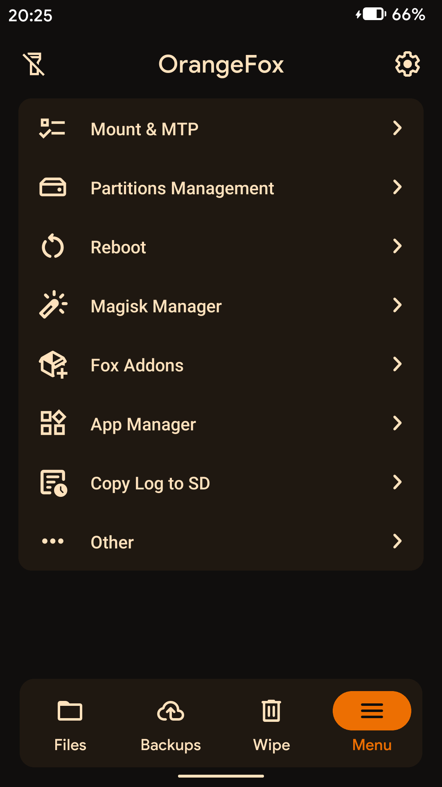
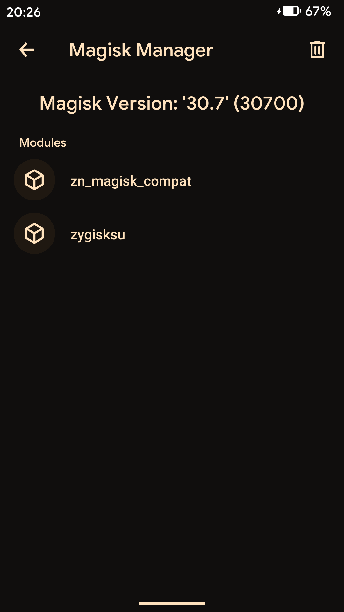
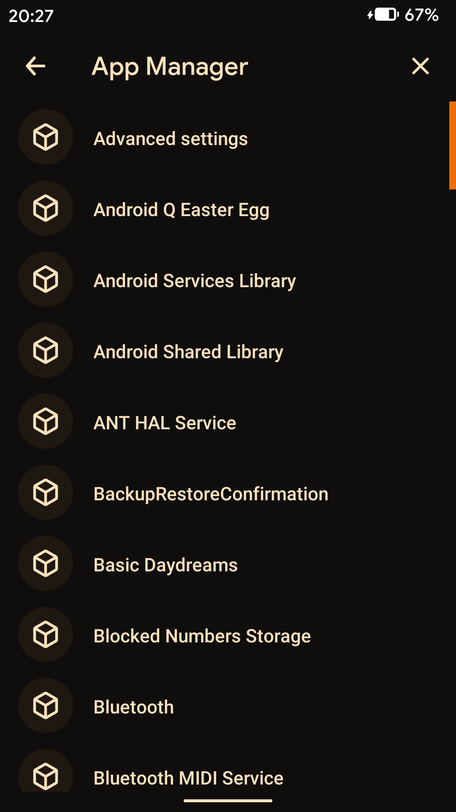
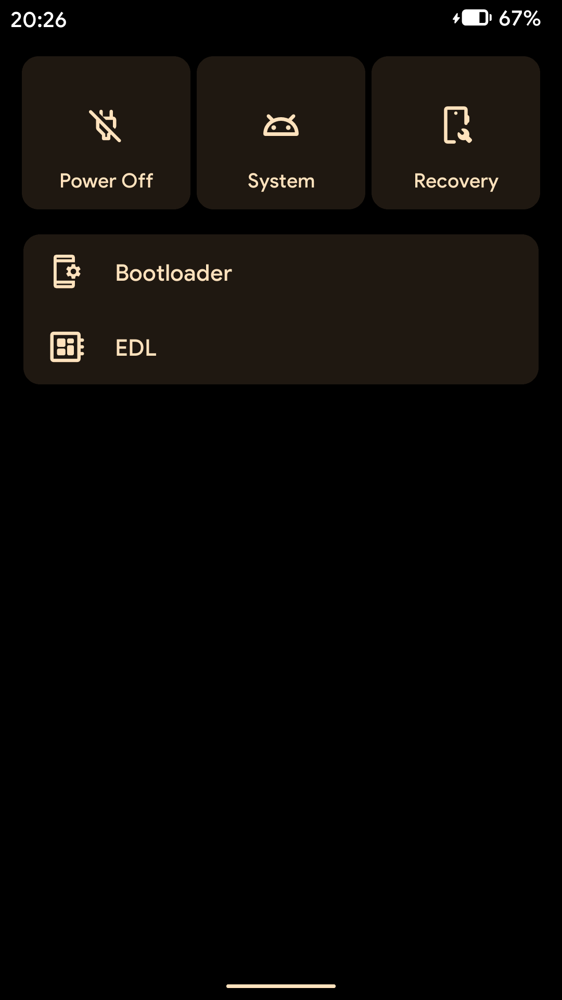
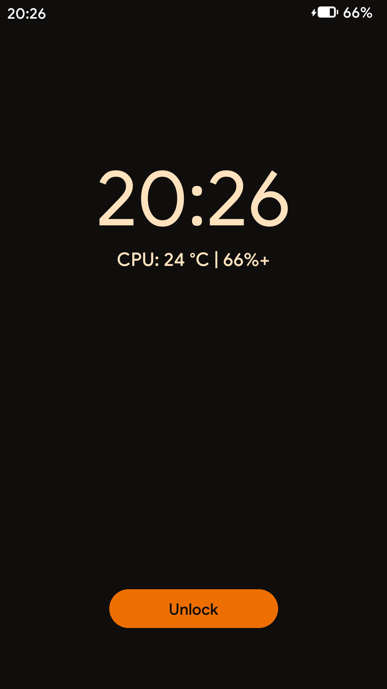

# 🔥 OrangeFox Recovery for Shamrock

A custom recovery project for <b>General Mobile 5 Plus (shamrock)</b> based on OrangeFox.


## ⚙️ Features

- Fast and stable recovery environment
- Built for General Mobile 5 Plus (`shamrock`)
- Based on OrangeFox sources
- Touchscreen support
- ADB support
- ZIP flashing
- Backup / Restore
- Wipe and Format support

## ✅ Working

- Touchscreen
- ADB
- ZIP flashing
- Backup / Restore
- Wipe
- Reboot options
- File Manager
- Magisk Manager
- App Manager

## ❌ Not Working

- ADB Sideload
- Data Decryption / Encryption (Not sure, not tested)

## 📱 Device Information

| Property | Value |
|----------|-------|
| Device | General Mobile 5 Plus |
| Codename | `shamrock` |
| Architecture | ARM64 |
| Android Base | Android 10 |
| Recovery | OrangeFox 12.1 |

## 📸 Screenshots

<details>
<summary>Click to view screenshots</summary>

| Files | Backup | Wipe | Menu |
|:---------:|:----:|:-------:|:-------:|
|  |  |  |  |

| Magisk Manager | App Manager | Reboot | Lock Screen |
|:------:|:--------:|:-----:|:-----:|
|  |  |  |  |

</details>

## 🔨 How to Build

Download and run the initialization script:

```bash
curl -fsSL https://raw.githubusercontent.com/adilaytanofficial/orangefox_shamrock/12.1/initialize.sh -o initialize.sh
sudo bash initialize.sh
```

The script will initialize the required build environment and dependencies.

## ⚠️ Disclaimer

This is an unofficial OrangeFox build for the General Mobile 5 Plus (`shamrock`).

Use this recovery at your own risk. Always keep a backup of your important data before flashing or modifying your device.
